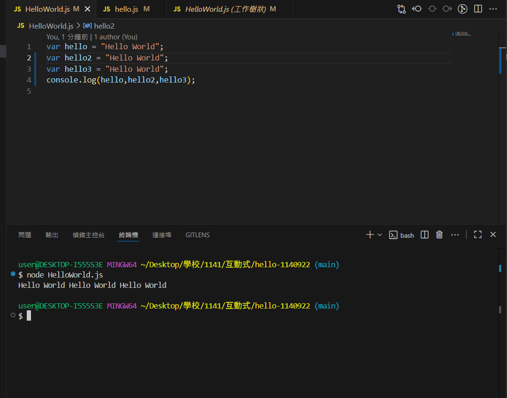

# 第1次作業-作業-HW1
>
>學號：112111127
><br />
>姓名：呂喬詠
><br />
>作業撰寫時間：180 (mins，包含程式撰寫時間)
><br />
>最後撰寫文件日期：2023/09/22
>

本份文件包含以下主題：(至少需下面兩項，若是有多者可以自行新增)
- [x] 說明內容
- [x] 個人認為完成作業須具備觀念

## 說明程式與內容

開始寫說明，該說明需說明想法，
並於之後再對上述想法的每一部分將程式進一步進行展現，
若需引用程式區則使用下面方法，
若為.cs檔內程式除了於敘述中需註明檔案名稱外，
還需使用語法` ```語言種類 程式碼 ``` `，其中語言種類若是要用python則使用py，java則使用java，C/C++則使用cpp，
下段程式碼為語言種類選擇csharp使用後結果：

```csharp
public void mt_getResult(){
    ...
}
```

若要於內文中標示部分網頁檔，則使用以下標籤` ```html 程式碼 ``` `，
下段程式碼則為使用後結果：


1. 請實作同名稱檔案並將程式碼實作並印出其結果，其內容為Topic 1 投影片的第12~13頁。

Ans: 第1次隨堂
```js
var hello = "Hello World";
var hello2 = "Hello World";
var hello3 = "Hello World";
console.log(hello,hello2,hello3);

```
